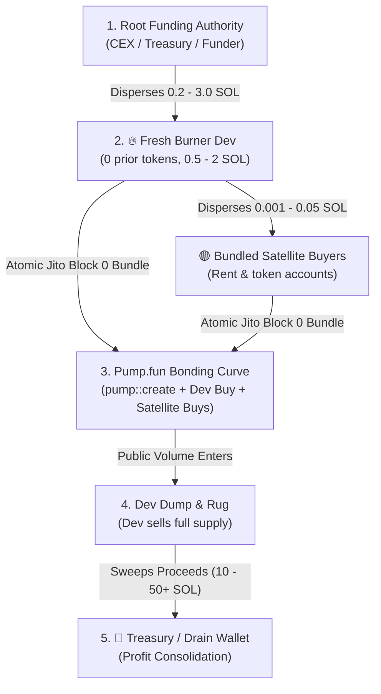

# 🎯 Pump.fun Developer Cluster Sniping Playbook

## 📜 0. Operator Core Objective & Archetype Classification

When the user provides a token mint or wallet address, **the ONLY objective is to identify a predictable launch pattern that can be profitably sniped**.

### 🏛️ The Two Rugger Archetypes (*Memecoin Bible* Acte V)

1. **Type 1: Serial Same-Wallet Deployers (PRIMARY FOCUS)**:
   - **Definition**: The operator creates multiple tokens from the **exact same wallet address** ($N \ge 2$, often dozens).
   - **Why it is prioritized**: Full launch history (Winrate, ATH distribution, dev dump speed, launch cadence) is directly attached to the public address. It is the most reliable, actionable, and predictable target for manual users and automated snipers.
   - **Operational Strategy**: Score historical winrate and EV directly from the wallet's signatures. Arm an event listener directly on this known wallet address awaiting the next `pump::create`.

2. **Type 2: Disposable Burner-per-Launch Operators (Cluster Tracking)**:
   - **Definition**: The operator creates a brand new, clean disposable burner wallet for each individual token (1 token per wallet, 0 prior history on the deployer itself).
   - **Operational Strategy**: The deployer address cannot be predicted beforehand; the system MUST watch upstream funding nodes (mother / relay / CEX) in real-time to detect the staging transfer (0.2 - 3.0 SOL) and dynamically arm the listener on the newly funded burner before `pump::create`.

---

## 📋 1. Systematic Target Reporting Contract

Every analysis MUST deliver:

1. **Archetype Sorting**: Explicitly declare whether the target is **Type 1 (Same-Wallet Serial Dev)** or **Type 2 (Burner-per-Launch Cluster)**.
2. **Launch History & Frequency**:
   - How often does this dev/operator launch? (e.g. 1 launch every 4 hours, burst of 3 daily).
   - Distribution of historical ATHs (median ATH multiplier, peak ATH, 1s floor liquidity).
   - Dev exit speed (instant block-0 dump vs 30s-120s pump curve).
3. **Qualification & Net EV (*Memecoin Bible* Acte V)**:
   - Sample size $N \ge 10$ launches.
   - Winrate ($\ge 70\%$) at optimal Take-Profit (e.g. $+50\%$).
   - Net expected value after fees: $\text{EV} = (W \times \text{TP}) - (L \times \text{SL}) - \text{Fees} > 0$.
4. **Target Arming & Notification Action**:
   - For Type 1: Re-arm persistent listener directly on the known dev wallet address.
   - For Type 2: Identify the staged burner wallet or arm on upstream funder.

---

## 🏗️ 2. Architecture & On-Chain Operator Lifecycle

Serial Pump.fun developers follow a strict, repeatable 5-phase lifecycle:



---

## 🏷️ 3. Deterministic Wallet Classification Heuristics

To prevent confusing treasury sweepers with deployers, all cluster nodes are strictly classified using deterministic on-chain invariants:

| Wallet Type | Staged Capital | Mints Count | Lifetime Tx Pattern | Operational Role |
| :--- | :--- | :--- | :--- | :--- |
| **`🔥 NEXT DEPLOYER`** | **0.20 – 5.00 SOL** | **0 tokens** | 1–2 inbound transfers received in last hours/days | **Next Target**. The burner wallet created for the upcoming token launch. |
| **`🎯 REPEAT BUNDLER`** | **0.05 – 3.00 SOL** | 0 tokens | Co-funded across **>= 2 creator launches** | **Fixed Insider Buyer**. Reused across launches in slot 0; confirmed co-snipe trigger. |
| **`🏦 TREASURY / DRAIN`** | **> 5.00 SOL** | 0 tokens | Multiple large incoming transfers *after* launches | **Profit Consolidator**. Sweeps out rug proceeds. Never launches tokens. |
| **`🟡 BUNDLED BUYER`** | **0.001 – 0.15 SOL** | 0 tokens | Micro-transfers received right before creation | **Satellite Sniper**. Used by dev to buy first candle in slot 0. |
| **`👨‍💻 ACTIVE CREATOR`** | Variable | **>= 1 tokens** | Previous `pump::create` instructions on-chain | **Historical Dev**. Used for past token deployments. |

---

## ⚡ 4. Unified One-Liner CLI Commands

### A. Full Target Resolution, Cluster Graph & Analytical Backtest
Run this single command from any token mint address or wallet:

```bash
uv run rug_wallet <TOKEN_MINT_OR_WALLET> --backtest --enroll
```

**Standard Dossier Output**:
```text
==============================================================================
 🎯 RUGBOT TARGET & CLUSTER SNIPING INTELLIGENCE
==============================================================================
 Input Target:          E9CqsGL5uXPASB853f87ox8nZVgW7ucoeYMC4bN8pump
 Resolved Token:        Gustopher the Gator ($Gustopher)
 Creator Wallet:        2r2HuRi1vLzVxXnWAffWfsAMDkQpfG1c23KPDgR4wp5p
 Archetype:             Type 1: Serial Same-Wallet Deployer (52 tokens)
 Root Funding Auth:     61mbw2ts9hzNGRN5PjZfBP15yxw6BGbHwkHhB1fkB8N3
 Connected Wallets:     86
 Cluster Token Mints:   52

------------------------------------------------------------------------------
 🎯 ARMED TARGET:
   • Address:        2r2HuRi1vLzVxXnWAffWfsAMDkQpfG1c23KPDgR4wp5p
   • Status:         ● ARMED - Persistent listener active on dev address
------------------------------------------------------------------------------

 📊 LAUNCH PATTERN & ATH PROFILE:
   • Launch Cadence:       1 launch every ~3.5 hours
   • Median ATH:           2.40x (Peak: 9.18x)
   • Dev Hold Time:        45s average before full sell
   • Optimal Take-Profit:  +20% (x1.20)
   • Historical Win Rate:  100.0% (52/52)
   • Net Expected Value:   +0.0494 SOL / trade
```

### B. Machine-Readable JSON Pipeline (for Autonomous Agents)
```bash
uv run rug_wallet <TOKEN_MINT_OR_WALLET> --json
```

---

## 🐍 5. Python SDK Usage for AI Agents

Subagents can execute target resolution and cluster prediction programmatically:

```python
from rugbot.intelligence.token_resolver import resolve_token_or_wallet
from rugbot.intelligence.wallet_intelligence import scan_wallet_intelligence
from rugbot.tracker.cluster_graph_model import build_cluster_intelligence_model
from rugbot.backtest.runners.cluster_optimizer import run_cluster_tp_grid_search
from rugbot.storage.tracker import SQLiteTrackerRepository
from rugbot.storage.database import DatabaseManager

# 1. Resolve seed token or wallet
resolved = resolve_token_or_wallet("E9CqsGL5uXPASB853f87ox8nZVgW7ucoeYMC4bN8pump")

# 2. Build cluster intelligence graph
db = DatabaseManager("data/tracker.db")
repo = SQLiteTrackerRepository(db)
model = build_cluster_intelligence_model(repo, resolved.root_funder)

# 3. Extract the predicted next deployer
if model.next_deployer_candidate:
    print(f"Arming sniper on: {model.next_deployer_candidate}")
    print(f"Staged balance: {model.next_deployer_funding_sol} SOL")
```

---

## 🖥️ 6. Visual TUI Operator Monitoring

To inspect the cluster in real-time with full interactive 2-pane dossiers:

```bash
uv run rug_tui
```

* **`Tab 1 (Targets & Execution)`**: Monitor live armed targets, assigned execution policies, and pending snipes.
* **`Tab 4 (Backtest Matrix)`**: Visual grid of analytical Take-Profit thresholds, ROI, launch cadence, and fee breakdowns.
* **`Tab 5 (Wallet Tracking & Intelligence)`**: 2-pane explorer detailing cluster topology, funding paths, and satellite coordination.
