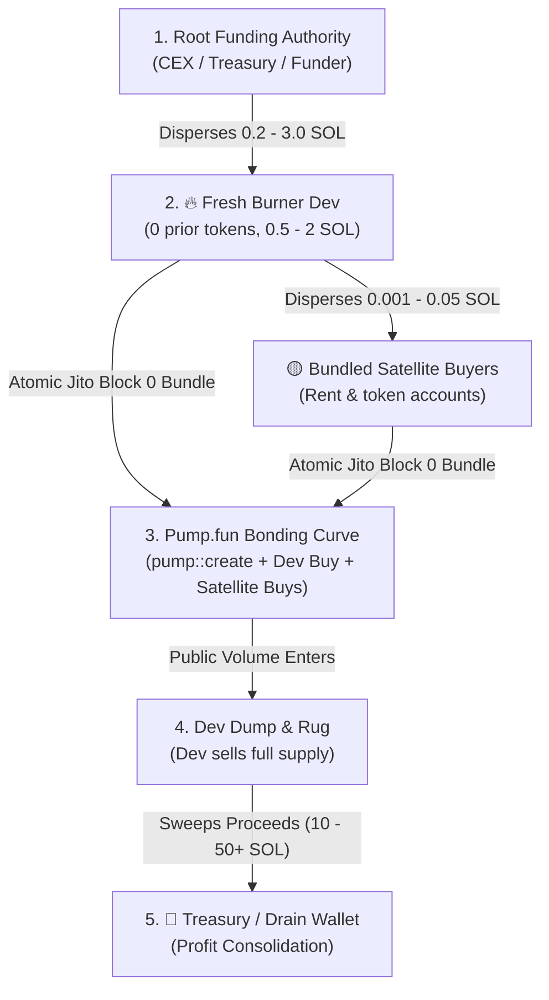

# 🎯 Pump.fun Developer Cluster Sniping Playbook

This skill defines the canonical, deterministic process to reverse-engineer serial Pump.fun ruggers and operators starting from a single token mint or dev address, identify their next staged burner wallets before token creation, optimize execution take-profit thresholds analytically, and execute block-0 snipes.

---

## 🏗️ 1. Architecture & On-Chain Operator Lifecycle

Serial Pump.fun developers follow a strict, repeatable 5-phase lifecycle:



---

## 🏷️ 2. Deterministic Wallet Classification Heuristics

To prevent confusing treasury sweepers with deployers, all cluster nodes are strictly classified using deterministic on-chain invariants:

| Wallet Type | Staged Capital | Mints Count | Lifetime Tx Pattern | Operational Role |
| :--- | :--- | :--- | :--- | :--- |
| **`🔥 NEXT DEPLOYER`** | **0.20 – 5.00 SOL** | **0 tokens** | 1–2 inbound transfers received in last hours/days | **Next Target**. The burner wallet created for the upcoming token launch. |
| **`🎯 REPEAT BUNDLER`** | **0.05 – 3.00 SOL** | 0 tokens | Co-funded across **>= 2 creator launches** | **Fixed Insider Buyer**. Reused across launches in slot 0; confirmed co-snipe trigger. |
| **`🏦 TREASURY / DRAIN`** | **> 5.00 SOL** | 0 tokens | Multiple large incoming transfers *after* launches | **Profit Consolidator**. Sweeps out rug proceeds. Never launches tokens. |
| **`🟡 BUNDLED BUYER`** | **0.001 – 0.15 SOL** | 0 tokens | Micro-transfers received right before creation | **Satellite Sniper**. Used by dev to buy first candle in slot 0. |
| **`👨‍💻 ACTIVE CREATOR`** | Variable | **>= 1 tokens** | Previous `pump::create` instructions on-chain | **Historical Dev**. Used for past token deployments. |

---

## ⚡ 3. Unified One-Liner CLI Commands

### A. Full Target Resolution, Cluster Graph & Analytical Backtest
Run this single command from any token mint address or wallet:

```bash
uv run rug_wallet <TOKEN_MINT_OR_WALLET> --backtest --enroll
```

**Example Output**:
```text
==============================================================================
 🎯 RUGBOT TARGET & CLUSTER SNIPING INTELLIGENCE
==============================================================================
 Input Target:          E9CqsGL5uXPASB853f87ox8nZVgW7ucoeYMC4bN8pump
 Resolved Token:        Gustopher the Gator ($Gustopher)
 Creator Wallet:        2r2HuRi1vLzVxXnWAffWfsAMDkQpfG1c23KPDgR4wp5p
 Root Funding Auth:     61mbw2ts9hzNGRN5PjZfBP15yxw6BGbHwkHhB1fkB8N3
 Connected Wallets:     86
 Cluster Token Mints:   52
 Staged Clean Wallets:  2

------------------------------------------------------------------------------
 🔥 PREDICTED NEXT DEPLOYER / SNIPER TARGET:
   • Address:        2r2HuRi1vLzVxXnWAffWfsAMDkQpfG1c23KPDgR4wp5p
   • Staged Balance: 0.446 SOL (Awaiting pump::create)
   • Status:         ● ARMED - Live listener active on creator address
------------------------------------------------------------------------------

 📊 ANALYTICAL BACKTEST & TP OPTIMIZER (52 Launches Evaluated):
   • Optimal Take-Profit:  +20% (x1.20)
   • Historical Win Rate:  100.0%
   • Net Simulated ROI:    +16.5%
   • Expected Value (EV):  +0.0494 SOL / trade
   • Total Fees Deducted:  0.0106 SOL
```

### B. Machine-Readable JSON Pipeline (for Autonomous Agents)
```bash
uv run rug_wallet <TOKEN_MINT_OR_WALLET> --json
```

---

## 🐍 4. Python SDK Usage for AI Agents

Subagents can execute target resolution and cluster prediction programmatically:

```python
from rugbot.intelligence.token_resolver import resolve_token_or_wallet
from rugbot.intelligence.wallet_intelligence import scan_wallet_intelligence
from rugbot.tracker.cluster_graph_model import build_cluster_intelligence_model
from rugbot.backtest.runners.cluster_optimizer import run_cluster_tp_grid_search, HistoricalTokenSample
from rugbot.storage.tracker import SQLiteTrackerRepository
from rugbot.storage.database import DatabaseManager

# 1. Resolve seed token or wallet
resolved = resolve_token_or_wallet("E9CqsGL5uXPASB853f87ox8nZVgW7ucoeYMC4bN8pump")

# 2. Build cluster intelligence graph
db = DatabaseManager("data/tracker.db")
repo = SQLiteTrackerRepository(db)
model = build_cluster_intelligence_model(repo, resolved.root_funder)

# 3. Extract the predicted next deployer
if model.next_deployer_candidate:
    print(f"Arming sniper on: {model.next_deployer_candidate}")
    print(f"Staged balance: {model.next_deployer_funding_sol} SOL")
```

---

## 🖥️ 5. Visual TUI Operator Monitoring

To inspect the cluster in real-time with full interactive 2-pane dossiers:

```bash
uv run rug_tui
```

* **`Tab 1 (Targets & Execution)`**: Monitor live armed targets, assigned execution policies, and pending snipes.
* **`Tab 4 (Backtest Matrix)`**: Visual grid of analytical Take-Profit thresholds, ROI, and fee breakdowns.
* **`Tab 5 (Wallet Tracking & Intelligence)`**: 2-pane explorer detailing cluster topology, funding paths, and satellite coordination.
