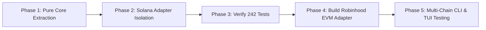

# Technical Specification: Decoupled Multi-Chain Architecture
## Cross-Chain Core for Solana (SVM / Pump.fun) & Robinhood Chain (EVM / Arbitrum Orbit)

---

## 1. Executive Summary & Problem Statement

### 1.1 Current Architecture Limitation
The existing `rugbot` codebase was developed specifically for Solana's Pump.fun protocol. While functionally robust, Solana-specific primitives (`solders.Pubkey`, `lamports`, `Slot`, 6-decimal tokens, `AccountMeta` vectors, Borsh discriminators) permeate the domain models and execution ports. 

Attempting to add support for an EVM chain—specifically the **Robinhood Chain** (an Arbitrum Orbit Layer-2 utilizing ETH for gas and standard ERC-20 contracts)—currently requires modifying dozens of core files or writing parallel implementations.

### 1.2 Architectural Goal
Transition `rugbot` to a strictly enforced **Ports & Adapters (Hexagonal Architecture)** model where:
1. **Core Domain & Strategy Logic** is 100% blockchain-agnostic:
   - Zero imports of `solders`, `web3`, `spl.token`, or `eth_account` in `core/`.
   - All addresses are treated as normalized opaque identifiers (`Address(str)`).
   - All amounts are tracked in normalized atomic integer units alongside standard decimal metadata.
2. **Chain Implementations** live exclusively within isolated **Adapters**:
   - `adapters/solana_pumpfun/`: Owns all Solana RPC calls, bonding curve math, PumpSwap AMM builders, and Jito MEV tips.
   - `adapters/evm_robinhood/`: Owns all EVM JSON-RPC calls, ERC-20 token allowance approvals, Uniswap-style router calldata, and EIP-1559 gas pricing.
   - `adapters/simulation/`: Owns virtual paper trading against live market data.
3. **Pluggable Runtime Injection**:
   - The user selects `CHAIN=solana` or `CHAIN=robinhood` in configuration.
   - The trading engine, trailing stops, risk gatekeepers, CLI, and TUI dashboards execute identically without a single `if chain == ...` branch in strategy code.

---

## 2. Target File Tree Structure

```text
src/rugbot/
│
├── core/                                # 100% CHAIN-AGNOSTIC CORE (Pure Python)
│   │
│   ├── models/                          # Universal Data Contracts
│   │   ├── address.py                   # Normalized Address value object
│   │   ├── order.py                     # OrderIntent, OrderSide, TradeReceipt, FillStatus
│   │   ├── position.py                  # ActivePosition, ClosedTrade, PortfolioMetrics
│   │   ├── quote.py                     # ExecutionQuote, PriceImpact, SlippageBounds
│   │   ├── candle.py                    # OHLCCandle, TradeTick (Time, Price, Volume)
│   │   └── token.py                     # TokenMetadata (address, symbol, decimals, chain_id)
│   │
│   ├── ports/                           # Abstract Boundary Contracts (The "Ports")
│   │   ├── execution_port.py            # Abstract Base Class for order execution
│   │   ├── market_data_port.py          # Abstract Base Class for price feeds & candles
│   │   └── wallet_port.py               # Abstract Base Class for balance & signing
│   │
│   ├── decision/                        # Business Rules & Algorithmic Strategy
│   │   ├── trailing_stop.py             # High-water mark & trailing stop calculator
│   │   ├── take_profit.py               # Tiered TP ladder calculator
│   │   ├── risk_gatekeeper.py           # Maximum exposure caps & emergency halt
│   │   ├── sizing.py                    # Position sizing formulas (Fixed, Kelly)
│   │   └── time_stop.py                 # Stale position exit timer
│   │
│   ├── tracker/                         # Entity Intelligence & EV Scoring
│   │   ├── operator_profiler.py         # Winrate, historical peak multiplier, EV math
│   │   └── cluster_graph.py             # Upstream funder tree analysis
│   │
│   └── storage/                         # Persistence Layer
│       ├── position_store.py            # SQLite active positions & state recovery
│       └── trade_ledger.py              # SQLite closed trades & PnL history
│
│
├── adapters/                            # CHAIN-SPECIFIC IMPLEMENTATIONS (The "Adapters")
│   │
│   ├── solana_pumpfun/                  # 🟣 Solana / Pump.fun Plugin
│   │   ├── client.py                    # Solana RPC client, failover pools, rate limits
│   │   ├── api.py                       # swap-api.pump.fun (1s candles, metadata)
│   │   ├── wallet.py                    # Implements WalletPort (Ed25519, solders.Keypair)
│   │   ├── market_data.py               # Implements MarketDataPort (Bonding curve + AMM)
│   │   ├── execution.py                 # Implements ExecutionPort (Jito tips, CU price)
│   │   └── builders/                    # Low-Level Solana Instruction Construction
│   │       ├── bonding_curve.py         # 27-account V2 bonding curve builder
│   │       └── pumpswap_amm.py          # 24/22-account PumpSwap AMM builder
│   │
│   ├── evm_robinhood/                   # 🟢 Robinhood Chain (Arbitrum Orbit EVM) Plugin
│   │   ├── client.py                    # Web3.py JSON-RPC HTTP/WS client
│   │   ├── wallet.py                    # Implements WalletPort (secp256k1, nonce manager)
│   │   ├── market_data.py               # Implements MarketDataPort (DEX reserves, logs)
│   │   ├── execution.py                 # Implements ExecutionPort (Approve + Swap)
│   │   └── contracts/                   # ABIs & Contract Helpers
│   │       ├── router.py                # Uniswap V2/V3 Router ABI encoder/decoder
│   │       └── erc20.py                 # ERC-20 token allowance & transfer encoder
│   │
│   └── simulation/                      # 🧪 Paper & Backtest Simulation Plugin
│       ├── paper_execution.py           # Implements ExecutionPort (fills virtually)
│       └── replay_execution.py          # Implements ExecutionPort (golden dataset replay)
│
│
├── interfaces/                          # DELIVERY MECHANISMS (Unchanged by chain)
│   ├── cli/                             # CLI commands: rug_trade, rug_watch, rug_backtest
│   ├── tui/                             # High-density Textual execution monitor
│   └── web/                             # FastAPI monitoring endpoints
│
└── config/                              # COMPOSITION & FACTORY
    ├── settings.py                      # Multi-chain configuration schema
    └── factory.py                       # Dependency Injection Factory (binds ports)
```

---

## 3. Core Domain Models (`src/rugbot/core/models/`)

### 3.1 Normalized Address
Addresses are wrapped to prevent stringly-typed bugs while keeping the core agnostic to Base58 or Hex formats:
```python
@dataclass(frozen=True, slots=True)
class Address:
    raw: str
    chain_id: str  # e.g., "solana:mainnet", "evm:robinhood_orbit"

    def __str__(self) -> str:
        return self.raw
```

### 3.2 Normalized Currency & Units
Amounts must avoid hardcoding `lamports` ($10^9$) or `wei` ($10^{18}$):
```python
@dataclass(frozen=True, slots=True)
class TokenAmount:
    raw_units: int
    decimals: int

    @property
    def ui_value(self) -> float:
        return self.raw_units / (10 ** self.decimals)

    @classmethod
    def from_ui(cls, value: float, decimals: int) -> TokenAmount:
        return cls(raw_units=int(round(value * (10 ** decimals))), decimals=decimals)
```

### 3.3 Universal Order Intent & Receipt
```python
class OrderSide(StrEnum):
    BUY = "buy"
    SELL = "sell"

class ExecutionMode(StrEnum):
    DRY_RUN = "dry_run"
    PAPER = "paper"
    LIVE = "live"

@dataclass(frozen=True, slots=True)
class OrderIntent:
    intent_id: str
    target_token: Address
    side: OrderSide
    amount_in: TokenAmount
    max_slippage_bps: int
    mode: ExecutionMode
    priority_fee_native: float
    tip_native: float

@dataclass(frozen=True, slots=True)
class TradeReceipt:
    ok: bool
    intent_id: str
    target_token: Address
    side: OrderSide
    tx_hash: str | None
    filled_amount_in: TokenAmount
    filled_amount_out: TokenAmount
    effective_price: float
    fee_paid_native: float
    error_message: str | None = None
```

---

## 4. Port Interfaces (`src/rugbot/core/ports/`)

The Core communicates strictly through three Abstract Base Classes (ABCs):

```python
from abc import ABC, abstractmethod

class ExecutionPort(ABC):
    """Port responsible for quoting, simulating, and broadcasting trades."""

    @abstractmethod
    async def get_quote(
        self,
        target_token: Address,
        side: OrderSide,
        amount_in: TokenAmount,
    ) -> ExecutionQuote:
        """Calculate expected output, price impact, and minimum output."""
        pass

    @abstractmethod
    async def execute(self, intent: OrderIntent) -> TradeReceipt:
        """Execute a buy or sell order (live or simulated)."""
        pass


class MarketDataPort(ABC):
    """Port responsible for price feeds, OHLCV candles, and token state."""

    @abstractmethod
    async def get_token_metadata(self, target_token: Address) -> TokenMetadata:
        """Fetch token symbol, name, decimals, and total supply."""
        pass

    @abstractmethod
    async def get_candlesticks(
        self,
        target_token: Address,
        interval: str,
        limit: int,
    ) -> list[OHLCCandle]:
        """Fetch standardized OHLCV candles."""
        pass


class WalletPort(ABC):
    """Port responsible for account balances and address queries."""

    @abstractmethod
    async def get_native_balance(self) -> TokenAmount:
        """Fetch native currency balance (SOL on Solana, ETH on Robinhood Chain)."""
        pass

    @abstractmethod
    async def get_token_balance(self, target_token: Address) -> TokenAmount:
        """Fetch specific token balance for the configured execution wallet."""
        pass

    @property
    @abstractmethod
    def public_address(self) -> Address:
        """Return the public address of the configured execution wallet."""
        pass
```

---

## 5. Adapter Implementations

### 5.1 Solana / Pump.fun Adapter (`adapters/solana_pumpfun/`)
* **Underlying Libraries**: `solders`, `spl.token`.
* **Execution Flow**:
  1. `get_quote`: Queries bonding curve virtual reserves via RPC or PumpSwap AMM reserves via `swap-api.pump.fun`.
  2. `execute`:
     - Checks auto-router: Bonding Curve vs. PumpSwap AMM.
     - Derives PDAs: `derive_bonding_curve` or `derive_amm_pool`.
     - Builds atomic instruction set: Compute Budget + Priority Fee + Jito Tip + ATA creation + Swap Instruction.
     - Signs with Ed25519 `Keypair` and dispatches via Jito Block Engine or RPC.

### 5.2 Robinhood Chain EVM Adapter (`adapters/evm_robinhood/`)
* **Underlying Libraries**: `web3.py`, `eth_account`.
* **Execution Flow**:
  1. `get_quote`: Calls DEX router contract `getAmountsOut(amountIn, [WETH, token])` via JSON-RPC `eth_call`.
  2. `execute`:
     - **Approval Check**: Checks ERC-20 `allowance(wallet, router)`. If allowance is below `amount_in`, builds and broadcasts an `approve(router, max_uint256)` transaction first.
     - **Swap Building**:
       - Buy: Encodes `swapExactETHForTokens(amountOutMin, path, to, deadline)` with `value=amount_in`.
       - Sell: Encodes `swapExactTokensForETHSupportingFeeOnTransferTokens(...)`.
     - **Gas Estimation**: Fetches base fee via EIP-1559 and calculates `maxPriorityFeePerGas`.
     - **Signing**: Signs with `eth_account.sign_transaction` (secp256k1) and submits via `eth_sendRawTransaction`.

---

## 6. Runtime Factory & Dependency Injection (`config/factory.py`)

No trading strategy or UI component instantiates network clients directly. The container instantiates the active adapter at startup based on `.env`:

```python
# config/factory.py

from rugbot.config.settings import Settings
from rugbot.core.ports.execution_port import ExecutionPort
from rugbot.core.ports.market_data_port import MarketDataPort
from rugbot.core.ports.wallet_port import WalletPort

def create_system_container(settings: Settings) -> tuple[ExecutionPort, MarketDataPort, WalletPort]:
    if settings.active_chain == "solana":
        from rugbot.adapters.solana_pumpfun.execution import SolanaPumpExecutionAdapter
        from rugbot.adapters.solana_pumpfun.market_data import SolanaPumpMarketDataAdapter
        from rugbot.adapters.solana_pumpfun.wallet import SolanaWalletAdapter

        wallet = SolanaWalletAdapter(settings.solana_private_key)
        market_data = SolanaPumpMarketDataAdapter(settings.solana_rpc_url)
        execution = SolanaPumpExecutionAdapter(
            rpc_url=settings.solana_rpc_url,
            wallet=wallet,
            jito_endpoint=settings.jito_block_engine_url,
        )
        return execution, market_data, wallet

    elif settings.active_chain == "robinhood":
        from rugbot.adapters.evm_robinhood.execution import RobinhoodExecutionAdapter
        from rugbot.adapters.evm_robinhood.market_data import RobinhoodMarketDataAdapter
        from rugbot.adapters.evm_robinhood.wallet import RobinhoodWalletAdapter

        wallet = RobinhoodWalletAdapter(settings.evm_private_key)
        market_data = RobinhoodMarketDataAdapter(settings.robinhood_rpc_url)
        execution = RobinhoodExecutionAdapter(
            rpc_url=settings.robinhood_rpc_url,
            router_address=settings.robinhood_router_address,
            wallet=wallet,
        )
        return execution, market_data, wallet

    raise ValueError(f"Unsupported chain: {settings.active_chain}")
```

---

## 7. Migration & Phased Rollout Plan



### Phase 1: Core Purification (Zero Breaking Changes to External Behavior)
1. Create `src/rugbot/core/models/` and `src/rugbot/core/ports/`.
2. Define chain-agnostic `Address`, `TokenAmount`, `OrderIntent`, and `TradeReceipt`.
3. Move `trailing_stop`, `take_profit`, and `risk_gatekeeper` into `src/rugbot/core/decision/`.

### Phase 2: Solana Adapter Encapsulation
1. Move `v2_builder.py` and `pumpswap_builder.py` into `src/rugbot/adapters/solana_pumpfun/builders/`.
2. Wrap them under `SolanaPumpExecutionAdapter` implementing `ExecutionPort`.
3. Wrap `pumpfun_api.py` under `SolanaPumpMarketDataAdapter` implementing `MarketDataPort`.

### Phase 3: Regression & Integrity Verification
1. Run full test suite (`uv run pytest`) verifying all 242 existing unit and integration tests pass identically.
2. Confirm `rug_watch --once` and backtester run with zero regressions.

### Phase 4: Robinhood Chain Adapter Implementation
1. Add `web3` dependency to `pyproject.toml`.
2. Implement `adapters/evm_robinhood/` with ERC-20 approval checks, Uniswap-compatible router swap builders, and EIP-1559 gas calculation.
3. Write isolated unit tests with mock EVM RPC contracts in `tests/adapters/test_evm_robinhood.py`.

### Phase 5: Multi-Chain CLI & Dashboard Support
1. Update `rug_trade` to accept `--chain {solana,robinhood}` (defaulting to configured `.env` default).
2. Verify live dry-run execution on both Solana Pump.fun and Robinhood Chain Arbitrum Orbit.
