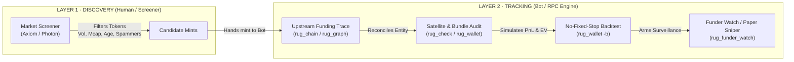
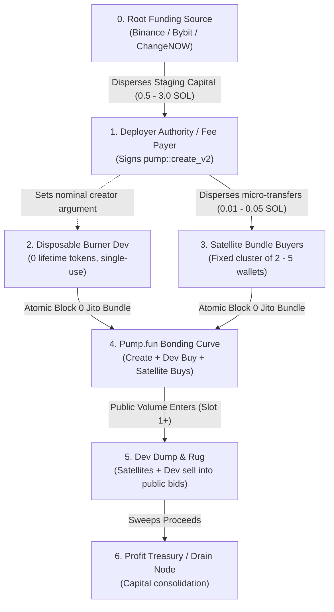

# 📖 The Memecoin Bible Operator Guide
## Autonomous Target Discovery, Cluster Reconstruction, & Sniping Playbook

> **Normative Reference**: Based on the *Memecoin Bible* (Acte I–V), `MEMECOIN_BIBLE_SCRAPED.md`, and project rules in `AGENTS.md`.

---

## 📑 Table of Contents
1. [Core Mandate & The Two Layers](#1-core-mandate--the-two-layers)
2. [Fundamental Law: Entity ≠ Wallet](#2-fundamental-law-entity--wallet)
3. [Archetype Taxonomy & Funding Shapes](#3-archetype-taxonomy--funding-shapes)
4. [End-to-End CLI Playbook & Command Reference](#4-end-to-end-cli-playbook--command-reference)
5. [Real-World Forensic Case Study: The Cat / Elizabeth Syndicate](#5-real-world-forensic-case-study-the-cat--elizabeth-syndicate)
6. [Mathematical Risk, EV & Exit Modeling](#6-mathematical-risk-ev--exit-modeling)
7. [Operating Cadence & Circuit Breakers](#7-operating-cadence--circuit-breakers)

---

## 1. Core Mandate & The Two Layers

The entire framework divides strictly into two disjoint operational layers:



### The Layer Contract
| | LAYER 1 · DISCOVERY | LAYER 2 · TRACKING |
|---|---|---|
| **Operator** | User, manual screener | Bot (Solana RPC, durable cache) |
| **Input** | Live market volume, price filters | One candidate token mint or wallet address |
| **Objective** | Filter out low-effort spam tokens | Map the operator's wallet entity & score net EV |
| **Rule** | Screens **TOKENS** | Follows **WALLETS / ENTITIES** |

> [!IMPORTANT]
> **Rule of Measurement**: The tool **measures**; the user **judges**. The CLI and analytical engines never output subjective verdicts like *"worth tracking"* or *"qualified"*. Thresholds are reference lines only.

### Layer 1 Screener Settings (Axiom / Photon)
When screening candidate mints to feed into Layer 2:
* **Platform**: Pump.fun only.
* **Quote**: Native SOL only.
* **Dev Creation Count**: $\le 5\text{--}10$ (eliminates automated 100-token mass spam bots).
* **Volume**: $\$20\text{k}\text{--}\$30\text{k}$ USD (proves real trading and bundle presence).
* **Maturity**: Mint $\sim 1\text{h}$ old, already dumped (full launch $\to$ ATH $\to$ floor cycle completed).
* **1s Creation Candle**: Market cap $\le \$15\text{k}$ USD (sanity ceiling; reject tokens where B0 was overpaid).

---

## 2. Fundamental Law: Entity ≠ Wallet

> `ASSERT: an entity is the SET of wallets one operator controls; a wallet is NEVER an entity.`

A single operator controlling Pump.fun tokens executes across a coordinated fleet of addresses:



### Wallet Classification Invariants
When mapping cluster nodes, classify them deterministically:
* **`🔥 NEXT DEPLOYER`**: $0.20\text{--}5.00\text{ SOL}$ staged capital, $0$ lifetime tokens, $1\text{--}2$ inbound staging transfers received recently.
* **`🎯 REPEAT BUNDLER`**: $0.05\text{--}3.00\text{ SOL}$ staged capital, $0$ created tokens, co-funded or co-buying across $\ge 2$ cluster launches in slot 0.
* **`🏦 TREASURY / DRAIN`**: $>5.00\text{ SOL}$, $0$ created tokens, multiple large inbound sweeps *after* launch dumps. Never creates tokens.
* **`👨‍💻 ACTIVE CREATOR`**: Past `pump::create` instruction on-chain.

---

## 3. Archetype Taxonomy & Funding Shapes

### The Two Archetypes (*Memecoin Bible* Acte V)
1. **Type 1: Serial Same-Wallet Deployer (Primary Focus S1)**:
   * **Behavior**: Operator creates multiple tokens from the **exact same public wallet address** ($N \ge 2$, often dozens).
   * **Action**: Score historical winrate, ATH profile, and net EV directly from the wallet's signatures. Arm an event listener directly on this known wallet awaiting the next `pump::create`.
2. **Type 2: Disposable Burner-per-Launch Operator (Cluster Tracking)**:
   * **Behavior**: Operator creates a fresh burner for each launch ($1$ token per creator, 0 prior history on the creator itself).
   * **Action**: History lives on upstream staging nodes and repeat satellite bundlers. Watch upstream funding nodes for the staging transfer ($0.2\text{--}3.0\text{ SOL}$) and monitor satellite co-buys in slot 0.

### The Three Funding Shapes
| Shape | Structure | Source ($S$) | Complexity | Protocol Action |
|---|---|---|---|---|
| **Shape 1** | Direct $A \to B \to C$ | Previous dev wallet | Low | Direct linear trace; arm on $B$. |
| **Shape 2** | $\text{CEX} \to \text{Fresh Wallet}$ | CEX hot wallet + tight amount band | Medium | Track the **AMOUNT band** (e.g. $2.40\text{--}2.60\text{ SOL}$) on fresh wallets. |
| **Shape 3** | Sub-mother relays $\to$ mixers $\to$ bundle wallets | Obfuscated / rotated relays | High | **Stop tracing funding.** Switch directly to **Satellite Copytrade** (co-timed B0 buyers). |

---

## 4. End-to-End CLI Playbook & Command Reference

The repo provides specialized, durable CLI utilities for every stage of the pipeline:

### Step 1 · Instant Mint & Bundle Inspection (`rug_check`)
Quickly examine creation slot, B0/B1 bundle composition, entry liquidity, and graduation status:
```bash
uv run rug_check <TOKEN_MINT>
```
*Example Output*:
```text
[-] DGH4iQd1wZn5... ($Elizabeth) | slot 447472896 | creator crkE...BSFX
  creation: slot 447471919  sig 4bo3jtaNoQ...
  bonding_curve: 97hJBRHvCnxHZGtQr7VffKvzCbb7j7wnNpmJYKhw5Ydh
  market: peak Mc 844.00 SOL  ath 27.23x  MIGRATED (PumpSwap)
  bundle: 4 buys total 2.3073 SOL  B0x4  B1x0
```

---

### Step 2 · Trace Upstream Funding Chain (`rug_chain`)
Walk backwards through multi-hop funding relays to the central funding authority or CEX in $\sim 2\text{ seconds}$:
```bash
uv run rug_chain <WALLET_OR_MINT>
```
*Example Output*:
```text
==============================================================================
 UPSTREAM FUNDING CHAIN
==============================================================================
  hop  0  [origin]  crkEgyToy77mA3WqWrAoVwUb8KT2AWxA7P5Dus6BSFX  sigs=90
  hop  1  [relay ]  9XK5yHHJuYkz9SHikWvdMVcQcQ2ftuQ1xL2ri74RS58t  sigs=1000
 *hop  2  [hub   ]  A73YiLh9SQs821cwCmErrp6oWe8WJzT3eCqdGVinjp2b  sigs=631
  hop  3  [relay ]  3cM2hLijBvApPnyN6p7GehdghTDFykZNYm2mP51WX5uZ  sigs=405
  hop  4  [CEX   ]  5otWRyzcb7D7DEGZoRJrn2RQ8mbGDDpWCntjh45fFKH1  sigs=1000

 HUB: A73YiLh9SQs821cwCmErrp6oWe8WJzT3eCqdGVinjp2b
```

---

### Step 3 · Graph & Reconcile Operator Fleet (`rug_graph`)
Perform bidirectional breadth expansion from any seed wallet to uncover all connected satellite bundlers, staging relays, and treasury nodes, persisting them to the SQLite tracker:
```bash
uv run rug_graph <SEED_OR_DEPLOYER_WALLET>
```
*Discovers same-slot fan-out batches, classifies wallet roles, and prevents double-counting across the cluster.*

---

### Step 4 · Analytical Backtest & Enrollment (`rug_wallet`)
Run Take-Profit grid optimization, ATH profiling, and cluster enrollment:
```bash
uv run rug_wallet <TOKEN_MINT_OR_WALLET> --backtest --trace-funding
```
*Flags*:
* `--backtest` / `-b`: Run analytical TP grid search over historical cluster launches.
* `--trace-funding`: Walk funding transfers to identify staged clean wallets.
* `--size 0.30`: Simulated trade buy size in SOL.
* `--enroll` / `-e`: Enroll targets into tracking DB (`rugbot.db`).
* `--json`: Emit machine-readable output for automated agent pipelines.

---

### Step 5 · Upstream Staging Watcher (`rug_funder_watch`)
Monitor funding nodes in real-time for staging disbursements ($0.2\text{--}3.0\text{ SOL}$) to catch Type 2 fresh burners before `pump::create`:
```bash
# Single pass
uv run rug_funder_watch --funder <FUNDER_WALLET> --once

# Continuous observation loop
uv run rug_funder_watch --funder <FUNDER_WALLET> --loop --interval 5
```

---

### Step 6 · Terminal Monitoring TUI (`rug_tui`)
Interactive 2-pane operator console for live execution monitoring, cluster graphs, and backtest matrices:
```bash
uv run rug_tui
```
* Key Tabs:
  * `Tab 1`: Armed targets & execution policies.
  * `Tab 4`: Analytical backtest matrix (Winrate, ROI, Cadence, Fees).
  * `Tab 5`: Cluster graph topology & satellite coordination.

---

## 5. Real-World Forensic Case Study: The Cat / Elizabeth Syndicate

During live on-chain analysis of token [`DGH4iQd1wZn5y85ynHFCdd3dU6MBaygHRh46VEWLpump`](https://solscan.io/token/DGH4iQd1wZn5y85ynHFCdd3dU6MBaygHRh46VEWLpump) ($Elizabeth), our engine dissected a classic Type 2 syndicate:

### Cluster Topology Discovered
* **Nominal Creator**: `crkEgyToy77mA3WqWrAoVwUb8KT2AWxA7P5Dus6BSFX` (fresh disposable burner).
* **True Deployer Signer**: [`DTSZozUpusYjCbrefrf5iUaPnoY4ZW2k9uRpPkWcZHHU`](https://solscan.io/account/DTSZozUpusYjCbrefrf5iUaPnoY4ZW2k9uRpPkWcZHHU) (funded from Binance Hot Wallet `BmFdpraQ...`).
* **Fixed 4-Wallet Jito B0 Bundle Group**:
  1. `A73YiLh9SQs821cwCmErrp6oWe8WJzT3eCqdGVinjp2b` — Buys **0.2016 SOL**
  2. `A2Pv13whNVqH1UME8zMy9rhkKLNcx8DfQCR79kxuLHLh` — Buys **0.5016 SOL**
  3. `7G1HkEuaRRxUgKsRzKjiSynM9x7e4v8QoWDGi5t5YHdY` — Buys **0.4016 SOL**
  4. `DRRceEguULKEcu8uryq8sDNv8VB4CjmaanQ2S2m7MAwM` — Buys **1.2026 SOL**
  * **Total Bundle Buy**: Exactly **2.3073 SOL** in Block 0.

### The "Bait & Retry" Playbook
The cluster executed 8 launches spanning 11 days with two distinct operational tempos:

| # | Mint | Token Ticker | Launch Time (UTC) | Result | Peak ATH |
| :--- | :--- | :--- | :--- | :--- | :--- |
| 1 | `Fzij8rMW...` | Catfish (`$CATFISHP`) | 2026-09-05 10:29 | Rugged / Abandoned | 1.4x |
| 2 | `9DHc1pwT...` | Jet Cat (`$JCATP`) *(Attempt 1)* | 2026-09-07 02:38 | Rugged / Dumped | 1.8x |
| 3 | `7ah5JjUR...` | Jet Cat (`$JETCATP`) *(Attempt 2)* | 2026-09-07 09:29 | **GRADUATED** | **18.5x** |
| 4 | `BAdtgJ56...` | MoonCoin (`$MoonP`) | 2026-09-08 12:19 | **GRADUATED** | **12.2x** |
| 5 | `c62hFdGv...` | OXCAT (`$OXP`) | 2026-09-10 08:28 | Rugged / Abandoned | 2.1x |
| 6 | `8cQ4C6NL...` | IncogCat (`$INCOGCATP`) | 2026-09-11 08:58 | **GRADUATED** | **22.4x** |
| 7 | `CqJS4j8r...` | Elizabeth Warren (`$ElizabethP`) *(Attempt 1)* | 2026-09-16 07:35 | Rugged in 11s | 1.3x |
| 8 | `DGH4iQd1...` | Elizabeth Warren (`$ElizabethP`) *(Attempt 2)* | 2026-09-16 08:01 | **GRADUATED** | **27.23x** |

### Key Tradecraft Observations
1. **Naming Signature**: Every ticker ended with a capital **`P`** (`CATFISHP`, `JCATP`, `JETCATP`, `MoonP`, `OXP`, `INCOGCATP`, `ElizabethP`).
2. **The 25-Minute Retry Routine**:
   * If Attempt 1 stalls at $\$2\text{k}\text{--}\$5\text{k}$ MC, the bundlers dump within 11s–45s.
   * Exactly **25 minutes later**, the operator redeploys the **exact same name, metadata, and IPFS image** from a new burner with the exact same 2.3073 SOL bundle.
   * **Retry Winrate**: 2 out of 2 retries graduated ($100\%$ on retries, $50\%$ across all launches).

---

## 6. Mathematical Risk, EV & Exit Modeling

### The Decision Metric: Net Expected Value
$$\text{EV} = \frac{1}{N} \sum_{i=1}^{N} \Big( \text{Exit Value}_i - \text{Entry Value}_i - \text{Fees}_i \Big)$$

A strategy is viable **if and only if Net EV > 0**. High winrate with negative EV is a failing strategy; lower winrate with positive EV is profitable.

### Two Separate Winrates (Never Conflate!)
1. **Bundler Winrate**: Did the operator make a profit? (Measures if the operator's bundle dumped into strength). This is an **operator behavior indicator**, not your strategy winrate.
2. **Sniper Backtest Winrate**: Did your replay make a profit after fees and slippage?

### No Fixed Stop on a Rug (NORMATIVE)
> [!CAUTION]
> **A fixed stop-loss (e.g. -15%, -25%) is an illusion on a liquidity rug.** When the dev or satellite bundle dumps, liquidity is drained in a single atomic transaction. There is no staircase of bids to fill your stop.

* **Primary Backtest Model**: **No-Fixed-Stop Model**. Either the Take-Profit (e.g. $+50\%$ / $+100\%$) is hit, or the exit executes at the **observed dev/bundle sell leg** (the floor).
* **Fixed-SL Tables**: Scenario / sensitivity analysis only.

---

## 7. Operating Cadence & Circuit Breakers

* **Primary Launch Window**: **07:30 to 12:30 UTC** (peak operator cadence; 7 of 8 launches occurred in this 5-hour window).
* **Position Sizing**: **2% to 5%** of bankroll per snipe. Never scale trade size; scale by distributing across multiple fresh buyer wallets.
* **Daily Circuit Breaker**: **5 consecutive losses** $\to$ Abort bot execution for the day.
* **Weekly Drawdown Breaker**: **$-35\%$ weekly drawdown** $\to$ Pause all bots and re-audit the operator fleet.
* **Operator Expiration**: Most serial operators rotate their funding topology and bundlers every **1 to 2 weeks**. Continuously re-run `rug_chain` and `rug_graph` to detect wallet churn.
